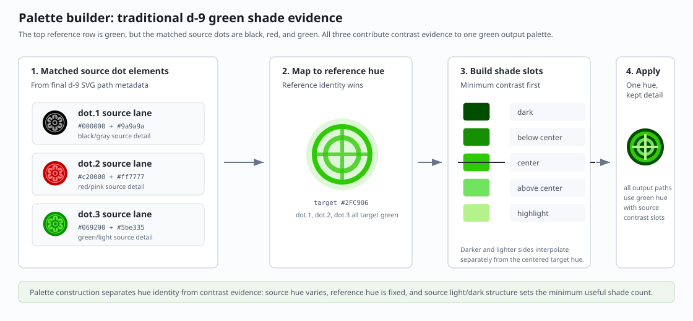
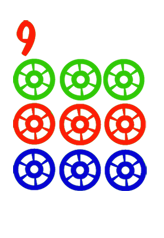
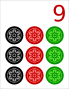

# Color Handling

This document owns the color model used by Final Rendering.

## Purpose

The pipeline turns source SVG paint and reference palette evidence into
discrete solid output colors suitable for physical inlay geometry. Source
paints can inform decisions, but generated 3D assets use separate mesh/material
regions rather than SVG paint servers or decals.

## Paint Evidence

Normalization records source paint evidence for components and shapes:

- solid fills and strokes
- opacity
- source paint ids
- gradients and `url(#...)` paint references
- source ancestry that explains where paint came from

Complex paints are evidence, not output format. Rendering resolves them into
representative flat colors.

## Palette Building

Final Rendering compares source paint evidence with reference colors and
effective rendering options. Palette selection can group hues differently for
ordinary suit structure, generated glyphs, and free-form artwork.

Reference colors remain the default structural output policy. Source colors are
opt-in where source style should be preserved.

  

## Repeated Element Shade Transfer

Repeated structured elements, such as dots and bamboos, need member-level color
translation rather than a simple source-color copy.

The reference owns which repeated members share a hue. The source owns the
internal contrast of each member. Final Rendering should therefore:

- identify the exact source member that corresponds to each reference member
- assign the reference hue family to the output member
- choose shades within that hue that preserve the source member's internal
  light/dark contrast
- color every output member with the same reference hue consistently, even if
  the corresponding source members used different hues

The important distinction is hue identity versus shade contrast. Hue identity
comes from the reference part correspondence. Shade contrast comes from the
source paints inside the matched source part so details do not collapse into a
flat shape.

Example: `traditional` `d-9`.

The reference dot colors are arranged horizontally, while the source artwork
uses a vertical color arrangement. In the final colored output, each dot must
follow the reference member's hue identity. Dots with the same reference hue
should use consistent output hue and shade ranges regardless of the source
dot's original hue, while the source dot's internal contrast should still be
visible.

<table>
  <tr>
    <th>Reference</th>
    <th>Source</th>
    <th>Final color output</th>
  </tr>
  <tr>
    <td></td>
    <td></td>
    <td></td>
  </tr>
</table>

## Free-Form Artwork

Free-form main artwork can preserve source colors through rendering options.
In that mode, source colors are still flattened to solid output colors, but the
artwork bypasses palette normalization intended for structured suit parts.

## Generated Labels And Glyphs

Generated labels and glyphs are rendered by the house glyph path generator and
colored according to rendering policy and reference part context. Source text
fonts are not used for generated house output.

## Negative Space And Cutouts

Negative-space components are treated as holes or cutouts in final geometry.
They should not become independent colored inlay regions unless a future
contract explicitly promotes that behavior.

## Color Ownership

Color handling owns paint choice only. It does not choose source bindings,
semantic part identity, alignment transforms, generated asset queue state, or
publication state.
