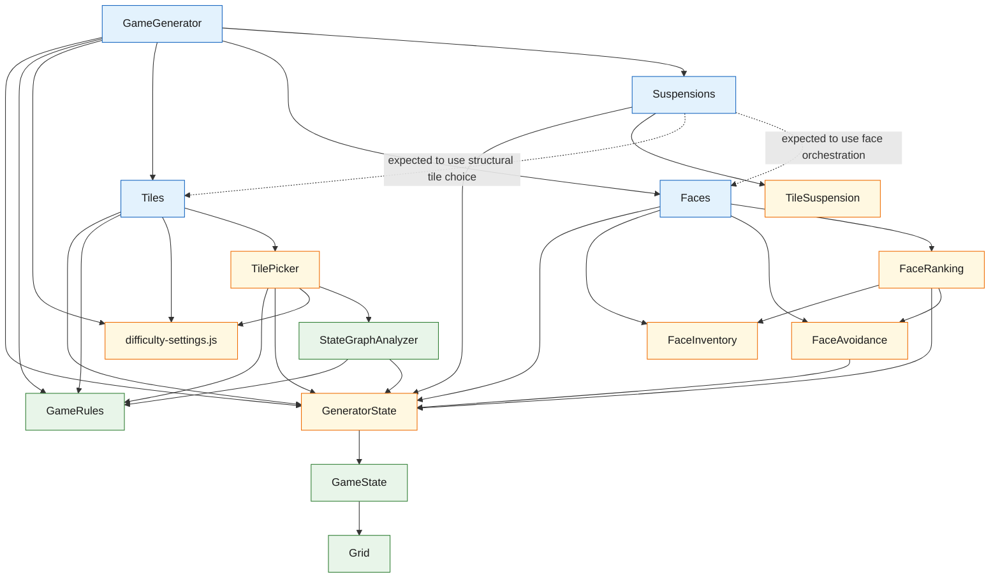

## Mah Jong Experimental Engine

Use these notes for the UI-less Mahjongg engine experiment under
`engines/mah-jong-experimental`.

The focus here is the generator-side architecture:

- shared state and rule layers
- generator collaborators
- class boundaries
- plans and mapping notes

Current shape:

- `Grid`
  - generic 3D occupancy grid
- `GameState`
  - Mahjongg-specific board and tile state on top of the grid
- `GameRules`
  - stateless questions about Mahjongg game state
- `StateGraphAnalyzer`
  - hypothetical questions over copied game state
- `TileSuspension`
  - suspension-domain record for delayed match release
- `GameEngine`
  - runtime state machine over game state
- `GameGenerator`
  - construction of a fresh generated game state
- `Tiles`
  - orchestration of structural tile-choice behavior during generation
- `Faces`
  - orchestration of face-selection and face-assignment behavior during generation
- `Suspensions`
  - orchestration of delayed-match creation and release behavior during generation

## Experimental Classes

- `Grid`
  - Generic sparse 3D occupancy storage for box add/remove/intersection queries.
- `GameState`
  - Mahjongg-specific board state layered on top of `Grid`, including tile positions, faces, placement, and cloning.
- `GameRules`
  - Stateless Mahjongg rules for open-tile checks, playable-pair checks, and win/loss evaluation.
- `GameEngine`
  - Runtime mutation shell for loading a generated board, playing pairs, undo/redo, selection, and derived state.
- `GameGenerator`
  - Active experimental board generator that authors structural pairs backward, assigns faces, and restores the final board for play.
- `Tiles`
  - Intended top-level orchestration layer for structural tile choice. It would sit above lower-level helpers such as `TilePicker` and expose tile-selection policy to `GameGenerator`.
- `Faces`
  - Intended top-level orchestration layer for face selection and assignment. It would sit above lower-level helpers such as `FaceInventory`, `FaceAvoidance`, and `FaceRanking`.
- `Suspensions`
  - Intended top-level orchestration layer for delayed-match creation, reservation, and release policy during generation.
- `TilePicker`
  - Structural tile scorer and selector used during generation.
- `StateGraphAnalyzer`
  - Copied-state analysis helper for hypothetical removals, stack-balance questions, freed-tile counts, and short-horizon probes.
- `FaceInventory`
  - Generation-time face inventory intended to own face sets, suit lookup, and later face-group draw logic.
- `TileSuspension`
  - Domain record for one suspended tile and its reserved release metadata.
- `FaceAvoidance`
  - Planned helper for soft face-assignment penalties that discourage easy local recovery matches.
- `FaceRanking`
  - Planned helper for face-group ordering, reuse spacing, and preferred-group bias during face assignment.
- `GeneratorState`
  - `GameState` extension for generator-specific shared state such as generation rules, difficulty options, and shared generator-side helpers. It is intended to be the shared state hub for the top-level generator orchestrators and the generator-side access path to `GameState`.

Top-level generator-orchestration intent note:

- the intended top generator-side orchestration band is:
  - `Tiles`
  - `Faces`
  - `Suspensions`
- `GameGenerator` should coordinate those concern areas rather than reaching
  directly into all lower-level helpers
- `TilePicker`, `FaceInventory`, `FaceAvoidance`, `FaceRanking`, and
  `TileSuspension` are better treated as lower-level helpers or domain records
  under that orchestration band
- the top-level plural nouns are intentionally broad so they describe concern
  areas rather than one specific algorithm

Generator-state intent note:

- `GeneratorState` is intended to be the shared generator-side state object
- the top-level generator orchestrators are expected to depend on it directly
- generator-side collaborators should access `GameState` through
  `GeneratorState`, not as a parallel direct dependency
- current expected direct consumers are:
  - `GameGenerator`
  - `Tiles`
  - `Faces`
  - `Suspensions`

## Class Relationships

Reading guide:

- solid arrows show current direct dependencies or active ownership, reversed
  from the previous version so higher-level classes point toward what they use
- dotted arrows show intended or partially wired relationships
- `GeneratorState` is the intended shared state hub for the top-level
  generator orchestration layer and the intended access path to `GameState`
- this graph is intentionally generator-focused, so `GameEngine` is omitted for
  clarity
- the cleanest intended top layer is `GameGenerator -> Tiles / Faces /
  Suspensions`
- green nodes are the most stable substrate classes
- blue nodes are the intended top-level generator orchestrators
- amber nodes are helper layers or areas still settling

This experiment stays separate from the feature UI tree so the core engine work
can be iterated and tested without dragging the browser/runtime layer through
every refactor.

Related notes:

- [Engine Split Notes](/c:/dev/poly-gc-react/agents/topics/engine-refactor/engine-split-notes.md)
- [Common Terms](/c:/dev/poly-gc-react/agents/topics/engine-refactor/common-terms.md)
- [Generator Build Plan](/c:/dev/poly-gc-react/agents/topics/engine-refactor/experimental-engine/generator-build-plan.md)
- [Archived Generator Build Plan A](/c:/dev/poly-gc-react/agents/topics/engine-refactor/experimental-engine/generator-build-plan-a-archived.md)
- [Current Status](/c:/dev/poly-gc-react/agents/topics/engine-refactor/experimental-engine/status.md)

## Glossary

### `layout`

The blueprint for where tile slots may exist.

`layout` defines:

- how many tile slots the board has
- where each tile slot can be placed

It does not define assigned faces or current play progress.

### `board`

The generated board definition for one game.

In this experiment, `board` is internal to `GameState`, just like `grid`.
It represents the generated tile definitions, including positions and assigned
faces.

After generation, the board should be treated as immutable.

### `play state`

The mutable runtime progress on a generated board.

Examples:

- which tiles are currently placed
- which tiles have been removed
- current occupied grid space
- undo/redo history
- current selection

### `Grid`

The generic sparse 3D occupancy structure.

`Grid` knows about:

- occupied points
- occupied boxes
- intersections

`Grid` does not know about Mahjongg rules, tiles, faces, or difficulty.

### `GameState`

The Mahjongg-specific state layer on top of `Grid`.

`GameState` is the only layer that should talk directly to:

- `grid`
- `board`

`GameState` exposes Mahjongg-facing operations like:

- tile enumeration
- tile position lookup
- tile face lookup
- placement/removal
- tile adjacency

### `GameRules`

The stateless Mahjongg business-logic layer.

`GameRules` answers questions such as:

- do these faces match?
- is this tile open?
- is this pair playable?
- is the board won or lost?

### `tile`

The conceptual Mahjongg tile or board piece.

Use this term when talking about the game concept rather than the numeric
handle used in code.

### `tileKey`

The board-local numeric handle used to refer to a tile in code.

Today this is backed by array indexing internally, but callers should treat it
as an opaque board-local key managed by `GameState`.

### `face`

The specific Mahjongg face assigned to a tile.

This is what gets matched during play.

### `face group`

The stable matching-group identity behind concrete faces.

Face-group identity is immutable. Inventory state may change during generation,
but a concrete face always belongs to the same face group.

### `solution`

One known valid removal path produced by generation.

This is generation output metadata. It is useful for callers, testing, and
analysis, but it is not part of `GameRules`.

### `difficulty`

The public generation level, such as:

- `easy`
- `standard`
- `challenging`
- `expert`
- `nightmare`

### `difficulty settings`

The full resolved generator rule bundle derived from a difficulty plus optional
overrides.
