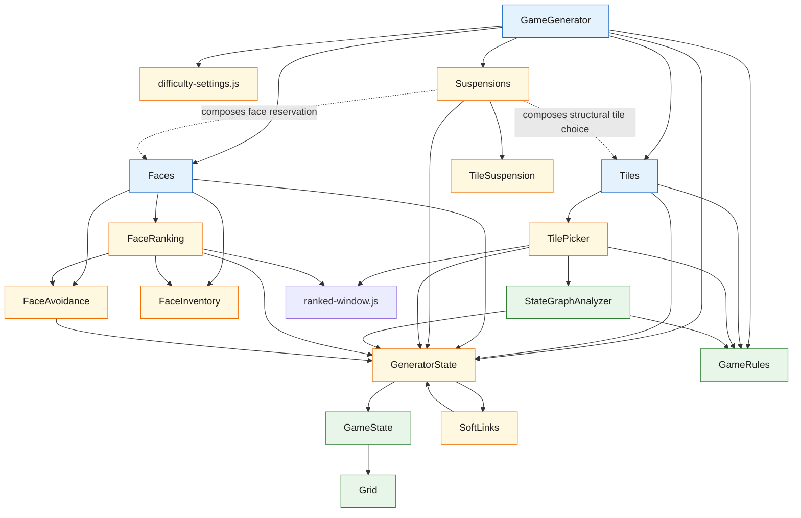

## Mah Jong Experimental Engine

Use these notes for the UI-less Mahjongg engine experiment under
`engines/mah-jong-experimental`.

The focus here is the generator-side architecture:

- shared state and rule layers
- generator collaborators
- class boundaries
- plans and mapping notes

Current shape:

- `Grid`
  - generic 3D occupancy grid
- `GameState`
  - Mahjongg-specific board and tile state on top of the grid
- `GameRules`
  - stateless questions about Mahjongg game state
- `StateGraphAnalyzer`
  - hypothetical questions over copied game state
- `TileSuspension`
  - suspension-domain record for delayed match release
- `GeneratedPair`
  - prepared tile-pair record for deferred face assignment metadata
- `SoftLinks`
  - generation-side registry for non-structural links between tile keys
- `GameEngine`
  - runtime state machine over game state
- `GameGenerator`
  - construction of a fresh generated game state
- `Tiles`
  - orchestration of structural tile-choice behavior during generation
- `Faces`
  - orchestration of face-selection and face-assignment behavior during generation
- `Suspensions`
  - cross-domain policy seam for delayed-match creation and release

## Experimental Classes

- `Grid`
  - Generic sparse 3D occupancy storage for box add/remove/intersection queries.
- `GameState`
  - Mahjongg-specific board state layered on top of `Grid`, including tile positions, faces, placement, and cloning.
- `GameRules`
  - Stateless Mahjongg rules for open-tile checks, playable-pair checks, and win/loss evaluation.
- `GameEngine`
  - Runtime mutation shell for loading a generated board, playing pairs, undo/redo, selection, and derived state.
- `GameGenerator`
  - Active experimental board generator that prepares structural pairs backward, assigns faces, and restores the final board for play.
- `Tiles`
  - Active top-level orchestration layer for structural tile choice. It sits above lower-level helpers such as `TilePicker` and exposes tile-selection policy to `GameGenerator`.
- `Faces`
  - Active top-level orchestration layer for face selection and assignment. It owns `FaceInventory`, shared `FaceAvoidance`, and `FaceRanking`.
- `Suspensions`
  - Active infrastructure seam for delayed-match creation, reservation, and release. It composes public `Tiles` and `Faces` capabilities rather than duplicating their lower-level helpers. The algorithmic policy methods are still shells.
- `TilePicker`
  - Structural tile ranker and selector used during generation.
- `StateGraphAnalyzer`
  - Copied-state analysis helper for hypothetical removals, stack-balance questions, freed-tile counts, and short-horizon probes.
- `FaceInventory`
  - Face-domain-owned inventory for face sets, suit lookup, concrete face-pair selection, selected-group availability, and assignment-history storage.
- `TileSuspension`
  - Domain record for one suspended tile and its reserved release metadata.
- `GeneratedPair`
  - Domain record for one prepared tile pair, including tile keys, assigned face pair, and preferred face group.
- `SoftLinks`
  - Simple generator-state registry for non-structural links between tile keys.
    It is not a generic connection registry. Link type describes how the tile
    list was formed, and link role describes the context in which it was
    recorded.
- `FaceAvoidance`
  - Shared generation-run penalty store for soft face-assignment pressure.
- `FaceRanking`
  - Face-group ranking helper for reuse spacing, preferred-group bias, easy duplicate expansion, and avoidance-aware ordering during face assignment.
- `GeneratorState`
  - `GameState` extension for generator-specific shared state such as generation rules, difficulty options, prepared pairs, active suspended records, and shared generator-side helpers. It is intended to be the shared state hub for the top-level generator orchestrators and the generator-side access path to `GameState`.
- `ranked-window.js`
  - Shared pure helper for difficulty-shaped ranked-window slicing and random selection. It is used by tile picking and face-group selection.

Top-level generator-orchestration intent note:

- the two primary generator domains are:
  - `Tiles`
  - `Faces`
- `Suspensions` is a higher-order generation-policy layer because delayed
  match behavior needs both structural tile selection and face reservation
- `GameGenerator` should coordinate those concern areas rather than reaching
  directly into all lower-level helpers
- `TilePicker`, `FaceInventory`, `FaceAvoidance`, `FaceRanking`,
  `SoftLinks`, `ranked-window.js`, `GeneratedPair`, and `TileSuspension` are
  better treated as lower-level helpers or domain records under that
  orchestration band
- the top-level plural nouns are intentionally broad so they describe concern
  areas rather than one specific algorithm

Generation-selection terminology:

- `candidate` means a ranked or weighted option before a choice has been made
- `selected` means the option chosen from a candidate set
- `committed` means the selected option has been accepted into generator state
  and any required working-board mutation has happened
- `prepared` means a committed tile-pair record is ready for face assignment
- `assigned` means face assignment is complete for a tile or pair
- `generated` means all generation stages are complete; today that usually
  follows assignment immediately, but later stages may be inserted between
  assigned and generated
- for the current normal tile-pair flow, `TilePicker` ranks tile candidates,
  `Tiles.selectGeneratedPair()` selects a generated tile pair, and
  `GameGenerator.commitGeneratedPair()` commits it into `preparedPairs`
- for the current face flow, `FaceRanking` ranks face-group candidates,
  `ranked-window.js` selects a difficulty-windowed face group,
  `FaceInventory.selectPairFromGroup()` selects concrete faces, and
  `Faces.assignFacesToPair()` applies them to the prepared tile pair and
  `GeneratorState`

Generator-state intent note:

- `GeneratorState` is intended to be the shared generator-side state object
- `GeneratorState` is the sole source of truth for generation behavior after
  difficulty settings are resolved for a run
- difficulty-derived behavior should be changed through `GeneratorState` setup
  methods, not through one-off method option bags
- the top-level generator orchestrators are expected to depend on it directly
- generator-side collaborators should access `GameState` through
  `GeneratorState`, not as a parallel direct dependency
- current expected direct consumers are:
  - `GameGenerator`
  - `Tiles`
  - `Faces`
  - `Suspensions`

Domain-boundary rule:

- shared information flows through `GeneratorState`
- data needed for playing the generated game belongs in `GameState`
- generation-only data belongs in `GeneratorState`, even when it is produced by
  one domain and consumed later by another
- `Tiles` and `Faces` are primary domains and should not reach laterally into
  each other
- `Suspensions` is allowed to coordinate `Tiles` and `Faces` through their
  public APIs because suspension behavior spans both domains
- `Tiles` owns structural tile selection and prepared-pair creation
- `Faces` owns face selection, face assignment, face-avoidance metadata, and
  assigned-pair behavior
- `Suspensions` owns delayed tile-pair creation and release policy without
  reaching into lower-level helpers such as `TilePicker`, `FaceInventory`, or
  `FaceRanking` directly
- if one domain appears to need information from another domain, first move the
  shared information into `GeneratorState` or a pure shared helper that reads
  `GeneratorState`
- domain orchestrators may share substrate classes such as `GameRules`,
  `StateGraphAnalyzer`, and `ranked-window.js`
- current pressure point: full-face-set reservation for future suspension flows
  is now exposed by `Faces.selectFullFaceSet()` as a public operation and
  should be composed by `Suspensions` when suspension policy is implemented

Structural-helper guidance:

- when a generator interface becomes complex enough to split into helper
  classes, treat the resulting group as one structural unit of the algorithm
- each helper should still be separately testable, which makes options-object
  dependency injection acceptable inside this tight generator cluster
- method parameters should describe real runtime inputs, not special testing
  controls
- except for passing mocks through construction seams, prefer stubbing
  `GeneratorState` or the relevant collaborator over adding method parameters
  solely to make tests easier
- when tests need to steer helper behavior, stub or mock the state/collaborator
  that production code already reads
- tests that need different generation behavior should mutate or configure
  `GeneratorState`; method parameters should remain operation context
- this does not imply app-level service/plugin semantics; the injection is for
  testability and boundary clarity within one generator unit
- prefer injecting the immediate collaborators needed by the structural seam,
  not every lower-level helper in the graph

Folder-restructure note:

- when the experimental engine is ready to move from a flat file layout into
  domain folders, reconsider where `StateGraphAnalyzer` belongs
- it currently supports generation, but it only depends on the `GameState`
  surface and may be better treated as shared analysis/tooling rather than as
  part of the generator domain
- one possible future home is a `tools` or `analysis` folder for helpers used by
  generation, hints, solver work, parity checks, and board diagnostics
- `ranked-window.js` is also a good future `tools` candidate because it is a
  pure cross-domain helper shared by tile and face selection
- future stats and analytics helpers may belong in the same area if they are
  pure, UI-less inspections over `GameState`, `board`, or `layout`
- if those analytics need app integration, persistence, export, debug UI, or
  cross-feature access, wrap the pure engine tools in a common service rather
  than making the engine tools depend on app infrastructure
- working distinction:
  - `tools` = pure engine analysis
  - common services = app-facing integration around those tools

## Class Relationships

Reading guide:

- solid arrows show current direct dependencies or active ownership, reversed
  from the previous version so higher-level classes point toward what they use
- dotted arrows show intended or partially wired relationships
- `GeneratorState` is the intended shared state hub for the top-level
  generator orchestration layer and the intended access path to `GameState`
- this graph is intentionally generator-focused, so `GameEngine` is omitted for
  clarity
- the cleanest intended top layer is `GameGenerator -> Tiles / Faces`, with
  `Suspensions` sitting one policy layer higher because it composes both primary
  domains
- green nodes are the most stable substrate classes
- blue nodes are the primary generator orchestrators
- amber nodes are helper layers or areas still settling

This experiment stays separate from the feature UI tree so the core engine work
can be iterated and tested without dragging the browser/runtime layer through
every refactor.

Related notes:

- [Engine Split Notes](/c:/dev/poly-gc-react/agents/topics/engine-refactor/engine-split-notes.md)
- [Common Terms](/c:/dev/poly-gc-react/agents/topics/engine-refactor/common-terms.md)
- [Generation Terms](/c:/dev/poly-gc-react/agents/topics/engine-refactor/experimental-engine/generation-readme.md)
  - human-facing generation documentation intended to become the official engine
    `README.md` when the experimental engine is promoted
- [Generator Build Plan](/c:/dev/poly-gc-react/agents/topics/engine-refactor/experimental-engine/generator-build-plan.md)
- [Live Face Assignment Flow](/c:/dev/poly-gc-react/agents/topics/engine-refactor/experimental-engine/live-face-assignment-flow.md)
- [Current Status](/c:/dev/poly-gc-react/agents/topics/engine-refactor/experimental-engine/status.md)
- Historical only: [Archived Generator Build Plan A](/c:/dev/poly-gc-react/agents/topics/engine-refactor/experimental-engine/generator-build-plan-a-archived.md)

## Glossary

### `layout`

The blueprint for where tile slots may exist.

`layout` defines:

- how many tile slots the board has
- where each tile slot can be placed

It does not define assigned faces or current play progress.

### `board`

The generated board definition for one game.

In this experiment, `board` is internal to `GameState`, just like `grid`.
It represents the generated tile definitions, including positions and assigned
faces.

After generation, the board should be treated as immutable.

### `play state`

The mutable runtime progress on a generated board.

Examples:

- which tiles are currently placed
- which tiles have been removed
- current occupied grid space
- undo/redo history
- current selection

### `Grid`

The generic sparse 3D occupancy structure.

`Grid` knows about:

- occupied points
- occupied boxes
- intersections

`Grid` does not know about Mahjongg rules, tiles, faces, or difficulty.

### `GameState`

The Mahjongg-specific state layer on top of `Grid`.

`GameState` is the only layer that should talk directly to:

- `grid`
- `board`

`GameState` exposes Mahjongg-facing operations like:

- tile enumeration
- tile position lookup
- tile face lookup
- placement/removal
- tile adjacency

### `GameRules`

The stateless Mahjongg business-logic layer.

`GameRules` answers questions such as:

- do these faces match?
- is this tile open?
- is this pair playable?
- is the board won or lost?

### `tile`

The conceptual Mahjongg tile or board piece.

Use this term when talking about the game concept rather than the numeric
handle used in code.

### `tileKey`

The board-local numeric handle used to refer to a tile in code.

Today this is backed by array indexing internally, but callers should treat it
as an opaque board-local key managed by `GameState`.

### `face`

The specific Mahjongg face assigned to a tile.

This is what gets matched during play.

### `face group`

The stable matching-group identity behind concrete faces.

Face-group identity is immutable. Inventory state may change during generation,
but a concrete face always belongs to the same face group.

### `face set`

The inventory entry for one face group.

A full face set contains four matching concrete faces. Selecting a face pair
removes two concrete faces from a face set. Suspension generation may need to
reserve or remove a full face set, while normal prepared tile pairs only need
one face pair.

### `face pair`

Two concrete faces selected from the same face set for assignment to one tile
pair.

Face pairs are about matching imagery, not tile positions.

### `solution`

One known valid removal path produced by generation.

This is generation output metadata. It is useful for callers, testing, and
analysis, but it is not part of `GameRules`.

### `prepared pairs`

The prepared tile-pair layer for a generated layout.

The layout defines tile slots. Prepared pairs define which tile slots are
paired and the order in which those tile-pair commitments were generated.
Suspensions may delay tile-pair commitment while generation is running, but the
finished structural result is still a collection of prepared tile pairs ready
for face-pair assignment.

### `assigned tile`

A tile after face assignment.

An assigned tile belongs to a prepared tile pair and has received its concrete
face. It is useful to keep this separate from assigned pair: the pair describes
the relationship, while the tile describes one board slot with one concrete
face.

### `assigned pair`

A prepared tile pair after concrete face assignment.

An assigned pair has both board-local tile keys and the face pair that will be
shown on those tiles during runtime play.

### `generated tile`

A tile after all generation stages are complete.

Today, an assigned tile normally becomes a generated tile immediately. If a
future stage is inserted after face assignment, the tile should not be called
generated until that stage is complete.

### `generated pair`

A tile pair after all generation stages are complete.

Generated pair is the final pair-level term. Keep it separate from generated
tile so we can talk clearly about pair relationships and individual tile state.

### `tile pair`

Two board-local tile keys that form one structural or playable pair.

Tile pairs are about board slots and removal order. They do not imply anything
about which concrete face pair has been assigned yet.

### `candidate`

A ranked or weighted option before a choice has been made.

Use this term for lists such as tile scores, face-group rankings, or possible
suspension targets.

### `selected`

The option chosen from a candidate set.

Use this term after a picker has made a choice, but before the generator has
necessarily mutated its working state.

### `committed`

An option that has been accepted into generator state.

For backward board generation, committing a selected tile pair records it in
solution order and removes its tiles from the temporary full-board working
state.

### `difficulty`

The public generation level, such as:

- `easy`
- `standard`
- `challenging`
- `expert`
- `nightmare`

### `difficulty settings`

The full resolved generator rule bundle derived from a difficulty plus optional
overrides.

Once resolved for a generation run, these settings live on `GeneratorState` and
are treated as the source of truth for generator behavior.
