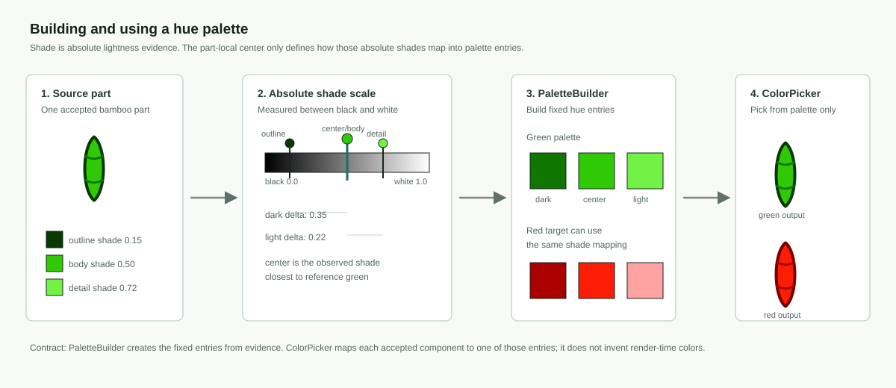

# SVG Preprocessor Scripts

Live scripts for the SVG preprocessor pipeline. This folder owns reference setup,
source SVG/component extraction, semantic preprocessing, comparison, validation,
and related review artifacts.

Common entry points:

- `run-reference-setup.js`
- `run-source-normalization.js`
- `run-source-alignment.js`
- `validate-reference-set.js`
- `run-preprocessed-face-pipeline.js`
- `validate-preprocessed-face.js`
- `compare-preprocessed-face.js`
- `inspect-source-svg-components.js`

Pipeline stage CLIs use the model-owned tileset id to derive canonical paths.
Pass `--tileset-id`; stage/state paths are not part of the active CLI
contract.

The UI-facing tileset manifest is
`scripts/output/asset-pipeline/tilesets.json`. Intake updates that
manifest and makes the ingested tileset active. The manifest owns only the
tileset id list and active tileset; per-tileset paths and stage details remain
owned by each tileset's canonical
`scripts/output/asset-pipeline/<tilesetId>/pipeline.json`.

Model-owned stage outputs live under
`scripts/output/asset-pipeline/<tilesetId>`. Functional JSON artifacts go in
`json/<artifact-type>`, and diagnostic/review images go in
`images/<image-type>` so browsable image outputs are not mixed by kind.

Shared path constants live in `../shared/asset-paths.js`.

## Color Handling

Color handling has two jobs that should stay separate:

1. Preserve what the source SVG actually contains as evidence.
2. Produce a normalized output palette that renders consistently across a
   tileset and works for downstream physical 3D inlay/material generation.

Source SVG paint is input evidence. It can be a flat color, an opacity-adjusted
paint, or a `url(#...)` paint server such as a gradient. Normalization and
final rendering may inspect that paint to infer shade, hue, and visual
intent, but prepared output should flatten complex paint into discrete solid
colors. The current 3D asset path consumes color regions as physical materials;
it does not consume continuous gradients or decal textures as the primary
model.

Source color detection and render color are separated so each can optimize for
its own job. Detection needs stable hue boundaries; if those boundaries stretch
too far into edge cases, source classification becomes ambiguous. Rendering
needs a wider, art-directed shade range so output colors can carry enough
contrast for physical materials and visual readability. The source detector can
therefore stay conservative while the renderer uses broader or adjusted output
anchors for the same hue.

This also gives the renderer a place to improve weak source color. Muddy,
low-contrast, or authoring-specific colors can be detected as evidence but
rendered through clearer, more vibrant palette entries. Those choices are often
best made at the tileset level, where the full set of source colors can be
reviewed and tuned into a coherent output palette. The default sprite sheet is
the motivating case: it contains a range of muddy colors close to brown that we
want to preserve as source evidence while rendering them as a more vibrant red.

Canonical part identity owns `colorStrategy`. That describes how a semantic
part should interpret color:

- `reference-shaded` means source geometry uses the matched reference hue as
  the output base while source paint contributes shade/intensity.
- `monochrome-reference` means labels and glyphs render with the dominant
  reference paint rather than source shade variation.
- `freeform-palette` means authored free-form artwork is still colored per
  part, but its colors are grouped by detected source hue instead of being
  forced into one reference hue.

Rendering options own render-side color behavior. They can choose whether
free-form artwork preserves flattened source colors, and future rendering
options may override output palette entries in a specific context. These
options should not rewrite source paint, source bindings, or canonical part
identity.

The pipeline uses balanced, discrete palette shades instead of simple tinting.
This is the original reason hue shades exist. Tinting is a local continuous
operation: it keeps much of the source color's original brightness and
saturation behavior, so the same semantic part can look different depending on
the SVG author's original paint choices. The palette model is tileset-wide:
each named hue should have a comparable set of usable hue shades,
such as dark, center, and light. A component can then ask for "the darker shade"
and receive the matching darker hue shade in green, red, blue, brown,
or another output hue.

That gives the renderer repeatable cross-coloring. The same bamboo geometry
with a light body, darker detail band, and outline can map to a balanced green
set or a balanced red set without one hue becoming flat and another
becoming over-shaded. It also keeps output friendly to the downstream 3D path:
prepared SVGs contain discrete material-color regions, not arbitrary tinted
variants or continuous color effects.

For example, a source `b-9` may contain nine bamboo sticks where three sticks
are red and the rest are green. If the chosen output is nine green bamboos, all
nine should use the same green body/detail/outline colors. The three red source
sticks should not become separately tinted green variants just because their
original source paint was red. Their geometry contributes the same bamboo shade
roles, and the renderer chooses the matching green palette shades for every
stick.

The color implementation is split into three surfaces:

- `Colors` is the exported singleton for stateless color utilities: parsing,
  perceived-distance checks, hue classification, interpolation, and helper
  mapping functions.
- `PaletteBuilder` builds fixed part-scoped hue palettes and component shade
  assignments from color evidence.
- `ColorPicker` receives those fixed palettes and chooses output colors from
  them. It does not create new colors.



The diagram shows the core contract: source paints are first measured on an
absolute shade scale, `PaletteBuilder` turns the part-local shade evidence into
fixed hue palette entries, and `ColorPicker` only selects from those entries.

### Palette Entries, Hue Shades, And Evidence

Palette entries are the individual colors in the complete output palette.
Hue shades describe how those entries are used inside a hue: dark green, center
green, light green, and so on. A hue shade therefore points at a specific
palette entry in a hue-relative role.

Shade itself is absolute. It is measured from the color's perceived lightness
position between black and white, not from an arbitrary local min/max inside a
part. A part-local set can choose which observed source shade is the center for
mapping, but the shade values being compared are still absolute lightness
facts. This keeps "darker" and "lighter" meaningful across source hues,
reference hues, and render hues.

Hue shades exist to give the renderer enough balanced shades for output. They
are not a permanent record of every source color observed. Source color
evidence should contribute to hue shades when that source color is part of the
rendered output decision. If a render-side palette or component override
replaces a source color, the original source color should not expand output
hue-shade coverage by default; the override's output color can contribute
instead when palette balancing needs it.

### Standard Hues

The current source detector defines hues with dark, center, and light anchor
colors. The center color is the canonical hue id used by the color code.
Source colors are classified in [OKLCH](https://www.w3.org/TR/css-color-4/#ok-lab) space:
low-chroma colors become white or black, a special low-lightness orange/yellow
range becomes brown, and the remaining chromatic colors are assigned by hue
angle. See more in the
[MDN `oklch()` reference](https://developer.mozilla.org/en-US/docs/Web/CSS/Reference/Values/color_value/oklch).

| Hue | Canonical center | Dark anchor | Light anchor | Classification summary |
| --- | --- | --- | --- | --- |
| White | `#F4F4F4` | `#B8B8B8` | `#FEFEFE` | Very low chroma and light, or very light low-chroma colors. |
| Black | `#000000` | `#000000` | `#6A6A6A` | Very low chroma and dark, or very dark low-chroma colors. |
| Red | `#FC1D05` | `#9C1204` | `#FF6B4A` | Chromatic red/orange-red hue range. |
| Orange | `#FF9900` | `#9C5200` | `#FFC04A` | Chromatic orange hue range, excluding colors classified as brown. |
| Brown | `#8A3A12` | `#4A1C00` | `#B8662A` | Low-lightness, moderate-chroma orange/yellow colors. |
| Yellow | `#F6F610` | `#9B9700` | `#FFFF61` | Chromatic yellow hue range. |
| Green | `#2FC906` | `#004D00` | `#73F246` | Chromatic green hue range. |
| Blue | `#0505D1` | `#02046F` | `#555CFF` | Chromatic cyan/blue hue range. |
| Purple | `#BC197A` | `#6F0D46` | `#F06DB8` | Chromatic purple/magenta hue ranges, plus very light red-pink. |

Rendering can override a hue's output anchors for a specific target behavior.
Those render anchors are not source-detection boundaries. For example, red
source detection stays conservative, while the red render range can extend
darker and lighter than the detection range to provide more contrast in output.
The render center should still be the reference color for that hue unless an
explicit rendering decision says otherwise.

| Render hue | Center | Dark output anchor | Light output anchor | Purpose |
| --- | --- | --- | --- | --- |
| Blue | `#0505D1` | `#02046F` | `#7F85FF` | Wider art-directed blue range with extra light-side headroom. |
| Red | `#FC1D05` | `#AA0000` | `#FFA2A2` | Wider art-directed red range for material contrast, with extra light-side headroom for two-shade red parts. |
| Brown-to-red | `#FC1D05` | `#AA0000` | `#FFA2A2` | Render brown-targeted output through the red material range. |

The brown-to-red case lets muddy brown source details contribute shade
structure without forcing a brown output material. This supports the default
sprite sheet's near-brown source colors that should be detected conservatively
but render as a more vibrant red. Future red render anchors may extend even
closer to black if the output material needs that contrast; that would still
not widen red source detection.

Free-form `source-hues` follows the same separation. A brown source paint is
first classified into the brown source hue, then the brown hue targets the red
render range. The source average, such as `#993300`, remains evidence; it is
not itself the render destination. Hues without a render-destination override,
such as pale pink in `d-1`, can still use their assigned source average so
authored free-form colors are not collapsed to a generic canonical hue.

Follow-up: compare the current hue set with
[ISCC-NBS broad color categories](https://www.munsellcolorscienceforpainters.com/ISCCNBS/ISCCNBSSystem.html)
and the original
[NIST color-name publication](https://www.nist.gov/publications/color-universal-language-and-dictionary-names).
ISCC-NBS gives a justifiable human-facing hue vocabulary: pink, red, orange,
brown, yellow, olive, yellow green, green, blue, purple, white, gray, and
black. The pipeline does not need to adopt every category as an output
material, but the README should explain the art-directed subset. Current likely
questions are whether gray should be split from white/black, whether olive or
yellow green should remain folded into yellow/green/brown, and whether pink
should remain folded into red/purple.

Later tileset-level palette decisions may need to define new search hues as
well as new render hues. A search hue changes source color detection and must
stay conservative enough to keep classification stable. A render hue changes
the output palette available to final rendering and can be more art-directed.
Those should remain separate decisions even when both are configured for the
same tileset.

### How Hue Shades Are Created

#### Why

Hue shades let the renderer preserve shade roles without preserving the source
hue. A component carries an absolute shade value from its source paint. The
builder then compares the part's observed absolute shades against the selected
center shade and records which colors are darker, centered, or lighter for
that part-local mapping. The output hue can change, but the shade comparison is
anchored in absolute lightness evidence.

#### How Many Hue Shades Exist

Hue-shade coverage is learned from color evidence across the tileset. The
palette starts with the standard hues and their center colors. When the
pipeline sees a source or reference color that is allowed to affect rendering,
it classifies that color into a hue and measures its absolute shade from
perceived lightness. If a target/reference paint is present, the source shade
is compared against that target's absolute shade; otherwise it is compared
against the classified hue center. Unique part-local offsets from the selected
center shade increase the available hue shades for that hue.

For overlap-based rendering, the source components that overlap the same target
part also determine the needed shade count. Their distinct source shades are
grouped as a part-local shade set, centered on the observed source shade
closest to the target/reference hue center. The active baseline summarizes
each set into a unique shade count, darker/lighter side counts, and the
largest positive shade delta on each side. Distinct lower or higher source
shades are counted as distinct shade roles even when their numeric lightness
distance is small; the renderer should not use fewer hue shades than the part
requires. Repeated components with the same normalized source paint do not
expand the hue-shade count.

The deltas in that summary are positive distances from the selected center.
Darker source shades have lower absolute shade values, so their stored
`darkDelta` is the positive distance from center down toward black. Lighter
source shades have higher absolute shade values, so their stored `lightDelta`
is the positive distance from center up toward white. The builder is not
tracking "the darkest shade in the whole tileset" as a semantic role; it is
tracking the largest part-local absolute shade distance needed on each side of
center.

The important unresolved design point is whether the builder should retain the
actual shade sets longer instead of collapsing them into summary values. A
future whole-hue analysis can keep every part-local set for a hue, analyze
those sets together, then build a global hue palette plus a part-local mapping
from observed shades to palette entries.

#### How Specific Shades Are Assigned

Source-to-reference mappings can carry those shade positions across hues. If a
red source component maps to a green reference component, the source red paint
does not mean "make a tinted red-green hybrid." It means "this component used
this absolute shade position, and in this part-local set it ranked on this
side of center." The same side/rank can then be created in the target green
hue. This is what lets mixed source colors produce consistent output: the
renderer reuses part-local shade mapping, not the original hue.

When components overlap the same target part, assignment should be based on
that part's own observed shade set. The global hue palette defines the possible
output colors, but the part-local mapping decides which of those entries this
part uses. This avoids both failure modes seen in the traditional bamboos:
allowing unrelated shade sets to leak a third visible green into a two-shade
part, and reducing every two-shade part to too little contrast.

The colorer uses the same center and side/rank logic as the builder. The center
source shade maps to the center palette entry. The first lower source shade
maps to the first darker palette entry, the second lower source shade maps to
the second darker entry, and so on; higher shades work the same way on the
light side. This means a source shade that is numerically close to center still
gets its own palette entry when it is a distinct lower or higher source paint
inside that part-local set.

Builder and colorer must choose the same center shade. The current baseline
chooses the observed source shade closest to the target/reference hue center,
then subtracts that center from each absolute source shade to get the local
offset used for side/rank. A mismatch here is a bug: if the builder and picker
use different center logic, the palette may have enough shades but components
will still pick the wrong entries.

Colorization is part-scoped. Components receive individual output fills, but
their hue-shade assignment is calculated and looked up in the context of the
semantic part that owns them. A component is not an independent color context.

Hue grouping controls how many hue groups a part builds:

- `target-hue`: all colors in the part map into one target/reference hue. This
  is the `reference-shaded` path used by normal face parts such as bamboos.
- `source-hues`: colors in the part are split by detected source hue, then each
  source hue group applies the same part-local anchor rule. This is the
  `freeform-palette` path used by free-form artwork. If the reference palette
  has no same-hue entry for a source hue, the target paint is synthesized from
  the rendered source components in that hue rather than falling back to the
  canonical hue center. This keeps pale authored colors, such as `d-1` pink,
  from being collapsed to a generic purple entry.
- `exact-source`: palette mapping is bypassed and flattened source colors are
  emitted directly. This is the preserve-colors rendering option for
  free-form artwork.

#### How Hue Shades Are Rendered

Palette construction resolves each hue shade to a concrete palette entry.
`PaletteBuilder` builds fixed hue palettes from the collected shade summaries:
unique shade count, darker/lighter side counts, and the largest positive
light/dark deltas from the local center. The reference hue color is always
included as the center palette entry. Darker entries interpolate from the hue's
dark output anchor to the center, and lighter entries interpolate from the
center to the hue's light output anchor. The active implementation uses the
standard dark, reference, and light output anchors for each hue, with separate
render anchors where an output hue needs a wider art-directed range.

Palette size comes from the largest observed need, not from ad hoc rendering
choices. For each hue, the builder keeps the maximum unique shade count, the
maximum darker-side count, the maximum lighter-side count, and the maximum
positive dark/light deltas reported by any eligible part-local collection. It
then allocates enough palette slots to preserve those side counts and spreads
them between the center and the output anchors using the recorded deltas.

This construction model is still under review. The current implementation has
enough behavior to render and test, but the correct model likely needs a
whole-hue shade-set analysis step: collect every part-local shade set for the
hue, choose a global palette that can represent the whole family of sets, and
emit a separate shade-to-entry mapping for each part or source-hue group.

Final rendering does not create colors. `ColorPicker` receives the fixed
palette and chooses the nearest entry by hue-relative shade distance in the
owning part context. If a target hue does not have enough entries for the
observed shade roles, multiple source shades may collapse to the same output
entry; that is palette coverage loss, not a new color to invent at render time.
Gradients, `url(#...)` paint servers, and authored source paint can inform
shade evidence, but prepared output is flattened to colors selected from the
built hue palettes.

This distinction matters for mixed artwork. For example, a tree may preserve
source colors overall, but one trunk or highlight color may map poorly. A
future render-side palette override should let that one output palette entry be
corrected for the face or suit without changing source evidence or teaching the
palette that an unused source color needs another output shade.

### Free-Form Artwork

Free-form artwork is still semantic artwork, but it is not treated like
repeated suit symbols. Dragons, flowers, seasons, `b-1`, and `d-1` can contain
authored illustration colors that should sometimes remain visually distinct
from the reference hue. Stage 6 currently supports a preserve-colors option
for free-form `mainArtwork` only. Preserved artwork still flattens complex
paint to solid colors and does not contribute to hue-shade mining.
Labels and glyphs continue to use their own render options.

### Render-Side Overrides

Future palette editing should live in rendering defaults and overrides:

```json
{
  "rendering": {
    "defaults": {
      "palette": {}
    },
    "overrides": {
      "suits": {
        "bamboo": {
          "palette": {}
        }
      },
      "faces": {
        "b-9": {
          "palette": {}
        }
      }
    }
  }
}
```

The intent is not per-component repaint as hidden state. A palette override
changes the output palette available in that rendering context. A later,
finer-grained component color override may be useful for detailed painting, but
that should still be an explicit final-rendering instruction keyed to accepted
component/part context.

## Color Vocabulary To Review

This list is intentionally reviewable. Some terms have been used loosely; keep
or rename them deliberately before expanding the color UI.

- **Source paint**: the fill/stroke/paint value from the source SVG component,
  including flat colors and `url(#...)` paint-server references.
- **Paint server**: an SVG definition referenced by paint, such as a gradient.
  It is input evidence and must be flattened before prepared output.
- **Source color evidence**: the interpreted color facts derived from source
  paint for scoring, hue-shade building, or diagnostics.
- **Reference paint**: the color sampled or recorded from the reference
  structure for a matched reference component or part.
- **Output paint**: the final solid color emitted into the rendered/prepared
  SVG.
- **Palette**: the full output color system available to the renderer.
- **Palette entry**: one specific color from the palette's full list of
  output colors.
- **Hue**: a canonical perceived color category, such as green, red, brown, or
  black. Older notes may say color family or color group; prefer hue in new
  docs, code, and UI labels. The code often keys this by canonical center hex
  values.
- **Shade**: an absolute perceived-lightness value between black and white.
  It is not relative to the darkest/lightest color in a part. Part-local
  mapping can store an offset from a chosen center shade, but that offset is
  derived from absolute shade values.
- **Hue shade**: a hue-relative shade that resolves to a specific palette
  entry, such as dark green, center green, or light green.
- **Palette evidence**: color evidence that is allowed to shape the output
  palette or hue-shade coverage.
- **Palette override**: a render-side replacement for one or more output
  palette entries in a default, suit, or face context.
- **Component color override**: a future render-side instruction for detailed
  painting of a specific accepted component/part context.
- **Color strategy**: canonical part-level interpretation of color, such as
  `reference-shaded`, `monochrome-reference`, or `freeform-palette`.
- **Color policy**: render-side choice about how output color should be
  produced in a context.
- **Preserve source colors**: a render-side free-form artwork option that emits
  flattened source colors and excludes those components from hue-shade
  mining.
- **ReflectX**: a render transform field for horizontal reflection. The UI may
  describe it as mirroring, but the stored transform term is `reflectX`.
