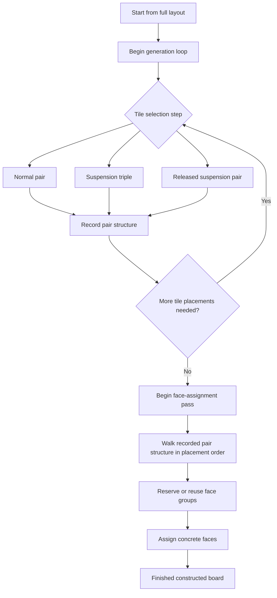
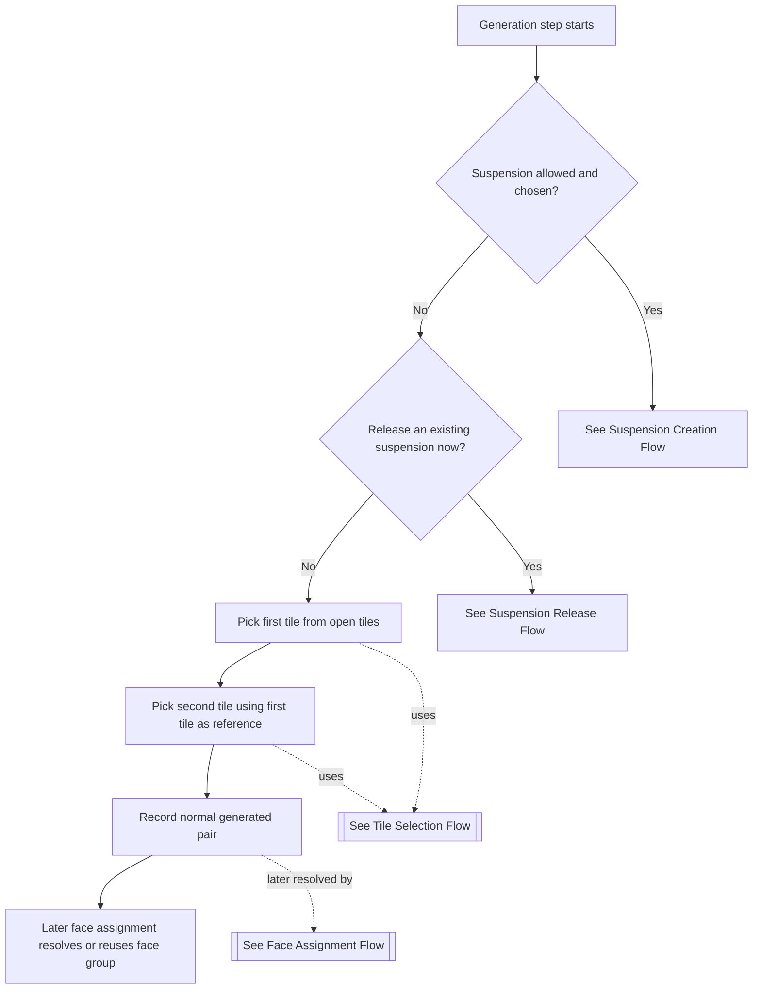
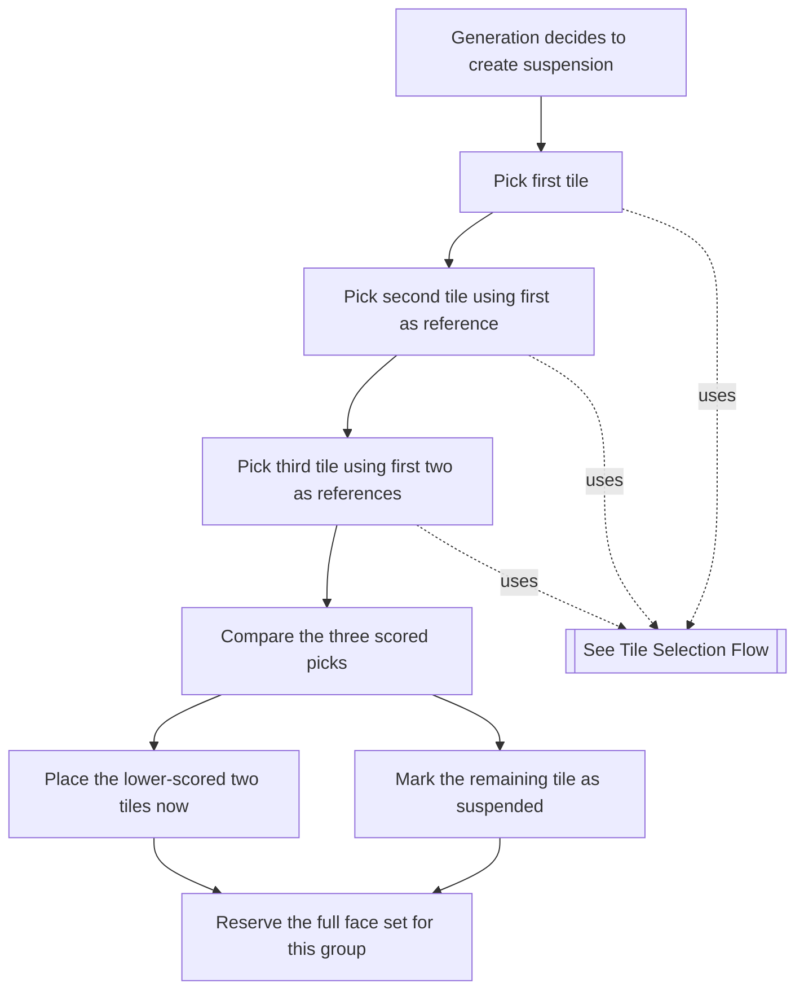
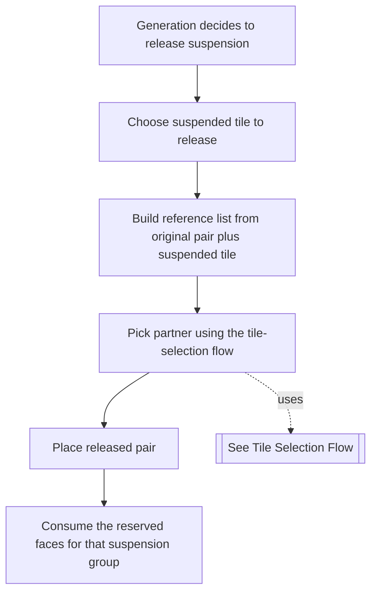
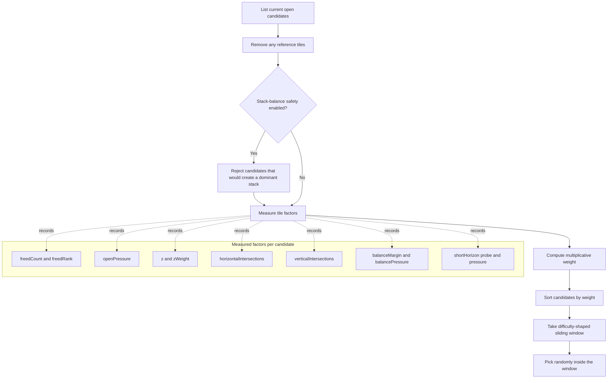
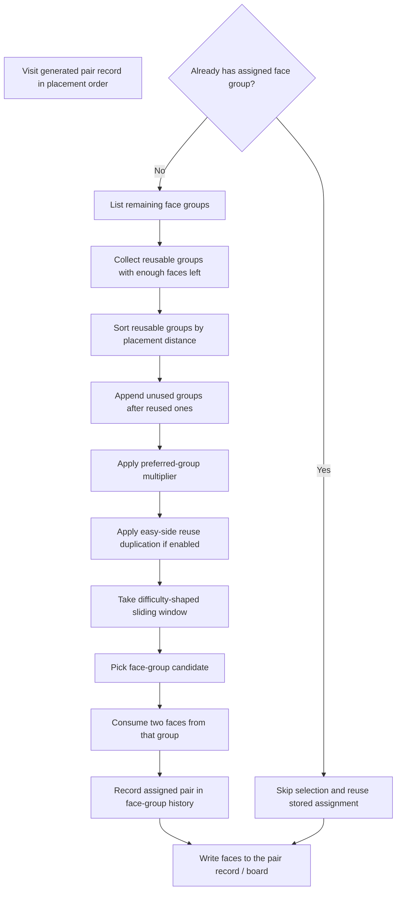

# Mahjongg Engine Difficulty

This directory contains the Mahjongg runtime engine and the first extracted
game-construction policy object, `GameGenerator`.

The difficulty work is about building boards that are still known to be
solvable, but whose wrong choices become more meaningful. A purely random board
can be brutal because it may simply be unsolvable. A constructed board needs a
different target: it should preserve at least one solution while shaping the
choice landscape around that solution.

## Table Of Contents

- [Problem Space](#problem-space)
- [Overview](#overview)
  - [Building Backward: Generation](#building-backward-generation)
  - [Coming Back Forward: Face Assignment](#coming-back-forward-face-assignment)
  - [End Result](#end-result)
- [Analytic Targets](#analytic-targets)
  - [Known Valid Solutions](#known-valid-solutions)
  - [Playout Solve Rate](#playout-solve-rate)
  - [Playout Dead-End Rate](#playout-dead-end-rate)
  - [Playout Average Remaining Tiles](#playout-average-remaining-tiles)
  - [P75 Dead-End Remaining Tiles](#p75-dead-end-remaining-tiles)
  - [Initial Downstream Dead-End Spread](#initial-downstream-dead-end-spread)
  - [Initial Downstream Remaining Spread](#initial-downstream-remaining-spread)
  - [Search Consequential Pair-Choice States](#search-consequential-pair-choice-states)
  - [Score](#score)
  - [Brutality](#brutality)
- [Current Level Ladder](#current-level-ladder)
- [Current Metric Shape](#current-metric-shape)
- [Outcome Summary](#outcome-summary)
- [Related Notes](#related-notes)

## Problem Space

Mahjongg difficulty is not just the number of currently playable pairs.
Human-facing difficulty comes from several overlapping pressures:

- how many legal choices are available
- whether two legal choices with the same face have different consequences
- how early a bad choice can collapse the board
- whether tall stacks stay unresolved long enough to create order pressure
- whether local face assignments accidentally create easy recovery matches
- whether the board stays balanced enough to avoid invalid terminal stack shapes

The generator therefore has two jobs:

1. build a known solution path by removing pairs from a full layout
2. assign faces and delay matches in ways that make off-path play more costly

`Engine` still owns the board state, face inventory, openness checks, picker
scoring helpers, and gameplay operations. `GameGenerator` coordinates the
construction flow: choose generated pairs, create or release suspensions, record
deferred pair records, and fill faces after construction.

## Overview

The current generator uses a stack of small, tunable algorithms rather than one
large solver pass. That keeps the system easy to experiment with.

The most useful high-level split is:

- tile selection
- face assignment

Those are related, but they are not doing the same job.

Tile selection is responsible for the board's structural path:

- which open tiles are removed next
- whether the current step becomes a normal pair, a suspension triple, or a
  released suspension pair
- how quickly the board opens up or stays tight
- how much stack pressure, geometric entanglement, and late-board fragility are
  being authored into the layout

Face assignment is responsible for the board's matching relationships:

- which generated pairs share a face group
- whether same-face reuse happens sooner or later in the authored sequence
- whether local face assignment creates cheap recovery matches
- how much same-face ambiguity or delayed consequence is layered onto the
  structural path

Put differently, tile selection shapes the skeleton of the puzzle, and face
assignment shapes the meaning of the choices on that skeleton.

This separation is important because the engine can make a board harder in two
very different ways:

- by changing which tiles become available and when
- by changing how those already-chosen tile pairs relate as matching faces

Suspension sits slightly across the boundary. It starts as a tile-selection
decision because it changes the authored removal order, but it also constrains
face assignment because a suspended group reserves a full face set and creates a
delayed matching relationship on purpose.

One subtle but important point: the board is authored backward and then
experienced forward.

During generation, the engine starts from the full layout and repeatedly
chooses tiles to remove. That means it is constructing a known-valid solve path
in reverse:

- generation asks "which tiles should come off next?"
- gameplay later asks "which tiles can the player remove next?"

So the generator is effectively writing the answer key backward, then handing
the player the finished board and asking them to rediscover a good forward path.

That is why the two phases below matter so much: tile selection shapes the
reverse-authored removal structure, and face assignment shapes how that
structure feels when replayed forward as a matching puzzle.

Suspension makes this even more important to understand. A suspension decision
is made while authoring the board backward, but its pressure is meant to be felt
later when the player moves forward into the finished board and discovers that a
matching partner was deliberately delayed.



At a glance:

- tile selection is a loop that builds the authored removal structure
- face assignment is a later pass over that recorded structure
- generation writes that structure backward from the full board
- gameplay later walks the finished board forward from the starting position
- the final board is the result of both passes, not just one or the other

### Building Backward: Generation

At the highest level, game construction is a loop that decides whether the next
step should:

- create a new suspension
- release an existing suspension
- or place a normal pair

That flow sits above the tile picker and above face assignment. The picker is a
reusable inner tool, while the generation flow decides what kind of pair or
triple is being authored next.

#### General Flow



The important thing to notice is that "pick a tile" is one reusable operation.
What changes across the generation flow is the reference list and what the
picked tile is being used for:

- first tile of a normal pair: no references
- second tile of a normal pair: first tile is the reference
- third tile of a suspension triple: first two tiles are the references
- released suspension partner: original pair plus suspended tile are the
  references

So the difficulty systems are layered in stages:

- the generation flow decides what kind of authored step happens next
- tile selection decides which open tile is structurally favored
- face assignment decides which face group that generated pair should carry

#### Suspension

Suspension delays a matching tile deeper in the generated solution order.
Instead of placing both pairs from a full face set immediately, the generator
places two matching tiles, suspends a third, and releases that suspended tile
later with its partner.

Suspension mainly creates delayed order pressure. The effect may not show up as
a bigger immediate same-face spread, because the consequence can land several
moves later.

The important physical detail is that a suspended tile stays on the board and
remains open. It is still visible in the finished layout and still counts as an
open tile in gameplay terms. What changes is its generation role: once a tile
is suspended, it is no longer available as a normal assignment candidate,
because its future matching relationship has already been committed.

Important controls:

- `frequency`: how often to try suspension
- `maxSuspended`: total suspension cap
- `maxNested`: active simultaneous suspension cap
- `placementCount`: how long to delay release
- `maxOpenCount`: open-tile release threshold
- `forceReleaseAtEffectiveOpen`: safety valve when open tiles get too tight
- `suspendAtEffectiveOpen`: creation threshold to avoid over-reserving opens

Suspensions need a full face set because they consume all four tiles from the
same face group across the placed pair, suspended tile, and later release pair.

##### Aggressive Suspension Profile

The current `aggressive` suspension profile is:

- `frequency: 0.8`
- `maxSuspended: 40`
- `maxNested: 4`
- `placementCount: 8..16`
- `maxOpenCount: 4..8`
- `matchType: both`
- `forceReleaseAtEffectiveOpen: 4`
- `suspendAtEffectiveOpen: 6`

In plain English, that means the generator tries to suspend often, allows
several suspensions to stay active at once, and keeps them delayed until the
board is both older and tighter. Release is normally blocked until enough pairs
have been placed and the open frontier has narrowed. The two effective-open
thresholds are safety valves so the generator does not over-reserve usable open
matches.

This profile targets delayed order pressure more than immediate pair-count
pressure. Its job is to:

- hide matching partners deeper in the authored solution
- make early removals matter further downstream
- increase the chance that a reasonable-looking line tightens into a dead end
- preserve enough board validity to keep the layout constructed rather than
  simply chaotic

When aggressive suspension is working well, the analyzer should show stronger
punishment on dead-end timing metrics such as average remaining tiles and `P75`
dead-end remaining, along with meaningful downstream pair-choice spreads.

The two diagrams below show the two halves of suspension separately:

- creation explains how a normal-looking generation step turns into a delayed
  relationship
- release explains how that delayed relationship is later completed

Keeping them separate makes it easier to see that suspension is not one special
pick. It is a two-stage authored promise made during generation and fulfilled
later.

##### Suspension Creation Flow

Suspension creation is the moment where the generator intentionally turns one
three-tile opportunity into a delayed future obligation. It places two tiles
now, leaves one open on the board, and commits the full face group so that the
later release is already authored.



The important parts of suspension creation are:

- three tiles are chosen in one authored step
- the two lower-scored tiles are placed immediately
- the third tile remains on the board as an open suspended tile
- the full face set is reserved so the suspended tile already has a committed
  future matching relationship

##### Suspension Release Flow

Suspension release is the later completion step. The suspended tile is already
fixed, so the only real choice left is which partner tile to pick to satisfy
the delayed relationship without losing the structural pressure created earlier.



The important parts of suspension release are:

- the suspended tile is already fixed
- only the partner is being chosen at release time
- the reference list is stronger than a normal pair because it includes the
  original pair and the suspended tile
- release completes the delayed matching relationship that was reserved earlier

#### Tile Selection

The picker scores currently open tiles, sorts them, chooses a difficulty-shaped
window from that sorted list, and randomly picks within that window.

This is the backward-authoring phase of the generator. Starting from the full
layout, tile selection decides which structural relationships will exist in the
finished board by deciding what comes off next.

This phase owns:

- normal pair placement
- suspension creation
- suspension release
- stack relief and frontier management
- most of the structural pressure that later becomes human-facing difficulty

#### Tile Selection Flow



This diagram is the reusable inner loop for tile selection. Every time the
generation flow needs a structural tile choice, this is the process it calls.

It helps to separate two layers in this system:

- natural picker weights: the picker's built-in structural opinion about which
  tiles are more or less significant
- difficulty dials: the controls that intentionally push generation toward
  easier or harsher outcomes

The default picker rules are the engine's built-in scoring behavior with no
extra overrides in `tilePickerRules`. In that baseline mode:

- difficulty still comes from `Engine.difficulty`
- the sliding window stays relatively broad by default
- horizontal and vertical intersection multipliers keep their built-in values
- z-weighting uses the layout depth as its ceiling
- explicit hard-side pressure terms stay modest unless a harder difficulty or a
  rule override turns them up
- stack-balance safety only applies on pick paths that explicitly enable it

So "default" does not mean flat random scoring. It means the weighted picker is
fully active, but only the core components are in play:

- freed-count ranking
- z-order bias
- horizontal reference intersections
- vertical reference intersections
- difficulty windowing

The harder experimental pressures, like strong explicit open-pressure,
stack-balance pressure, and short-horizon collapse pressure, are layered on top
of that baseline through rule overrides.

Easy settings bias toward the low-pressure side:

- remove higher z tiles earlier
- open more new tiles
- reduce tall stacks sooner

Hard settings bias toward the high-pressure side:

- leave taller stacks in place longer
- open fewer new tiles
- prefer geometrically entangled tiles
- move closer to stack-balance danger without crossing the safety boundary

The picker is used sequentially. For a normal pair, the second pick uses the
first tile as a reference. For a suspension triple, the third tile uses the
first two as references. For a released suspension, the original pair and the
suspended tile become the reference list.

#### Difficulty-Shaping Algorithms

##### Picker Weight Factors

The picker does not score tiles by one abstract difficulty number. It builds a
multiplicative weight from several measurable board properties:

```text
weight =
  freedRank
  * openPressure
  * zWeight
  * horizontalMultiplier^horizontalIntersections
  * verticalMultiplier^verticalIntersections
  * balancePressure
  * shortHorizonPressure
```

That means a candidate only rises to the hard side if several structural
signals agree. A tile can be mildly interesting in one dimension, but it takes
stacking signals to make it a strong hard-side choice.

The factors mean:

- `freedCount`
  - how many new tiles become open if this candidate is removed
  - this is the raw "what did this move unlock?" count
  - higher values usually mean the board opens up and becomes easier to manage

- `freedRank`
  - the rank of `freedCount` within the current open-candidate set
  - lower unlock counts get a larger rank number
  - this is the base structural opinion of the picker: low-unlock removals are
    naturally tighter and therefore heavier on the hard side

- `openPressure`
  - an extra difficulty-scaled multiplier derived from `freedCount`
  - on the easy side it stays neutral
  - on the hard side it increasingly rewards candidates that open fewer tiles
  - this is not the same thing as `freedRank`: `freedRank` is always present,
    while `openPressure` is the explicit hard-side amplifier

- `z`
  - the tile's current stack level from the board position
  - lower `z` means closer to the base of the layout, higher `z` means nearer
    the top

- `zWeight`
  - calculated from `highestZOrder - z`, clamped so the topmost layer still has
    weight `1`
  - lower tiles therefore carry more hard-side weight, while higher tiles stay
    lighter
  - easy tends to select the lighter high-stack tiles; hard tends to leave them
    in place longer and dig into lower support structure

- `horizontalIntersections`
  - how many reference-row masks the candidate intersects on the same level
  - this measures horizontal entanglement with tiles already chosen for the
    current pair or suspension step
  - more intersections imply that the candidate lives in the same local lane as
    the reference choice

- `verticalIntersections`
  - how many quarter-overlap masks the candidate intersects in x/y against the
    reference tiles
  - this measures vertical and offset overlap pressure, which tends to be more
    structurally significant than simple same-row overlap
  - the default vertical multiplier is stronger than the horizontal one because
    quarter overlaps often imply more consequential later accessibility

- `balanceMargin`
  - how far the post-removal board would remain from the dominant-stack danger
    condition
  - larger margin means safer and more balanced
  - smaller margin means the board is closer to an end-shape that would become
    structurally risky

- `balancePressure`
  - a hard-side multiplier derived from `balanceMargin`
  - neutral unless explicit balance pressure is enabled
  - once active, it rewards candidates that move closer to the balance edge
    without crossing into an invalid dominant-stack state

- `shortHorizonMoves`, `shortHorizonRemainingTiles`, `shortHorizonCollapsed`
  - probe outputs from a small greedy local simulation after temporarily taking
    the candidate
  - these are not used directly as the weight, but they describe why the
    resulting `shortHorizonPressure` was assigned

- `shortHorizonPressure`
  - neutral unless the short-horizon probe is enabled and the probe collapses
    quickly
  - earlier collapses produce larger hard-side pressure
  - this is the only picker factor that explicitly asks "does this choice seem
    to make the near future run out of air?"

The practical interpretation is:

- `freedCount` and `openPressure` measure how much breathing room the move gives
- `zWeight` measures how much stack relief the move provides
- `horizontalIntersections` and `verticalIntersections` measure how entangled
  the move is with the current reference choice
- `balancePressure` measures how close the move brings the board to stack-shape
  danger while still staying valid
- `shortHorizonPressure` measures whether the move appears to create an earlier
  local collapse

Because the factors multiply, a tile that is low-opening, low in the stack,
heavily intersecting, and balance-tight can quickly become a very strong
hard-side candidate. Conversely, a tile that opens lots of new space and trims
the top of a stack usually stays near the easy side of the ordered list.

##### Default Picker Profile

The current default picker profile targets general board shaping rather than the
more experimental early-dead-end work.

It mainly tries to:

- make easy boards open faster and clear higher stacks sooner
- make hard boards preserve tighter fronts and taller stacks longer
- make later picks in a pair or suspension respond to geometric entanglement
  with earlier picks
- preserve natural variability because the selection is still random inside the
  difficulty window

What it does not strongly target by default:

- explicit short-horizon collapse
- heavy stack-balance edge pressure
- aggressive anti-recovery face shaping

That is why the default picker works well for easy, standard, and challenging,
while expert and nightmare add extra pressure rules on top.

##### Sliding Difficulty Window

The difficulty value controls which part of the sorted tile list is eligible.

- `0` chooses near the easy end
- values near `0.5` keep a broad, more natural window
- `1` chooses near the hard end

The window gives the generator a continuum instead of a pile of hard rules.

##### Freed-Tile Pressure

Freed-tile pressure rewards or penalizes choices based on how many new tiles a
removal opens.

- easy favors opening more tiles
- hard favors opening fewer tiles

This helps control whether the board opens up quickly or stays tight.

##### Z Pressure

The z component biases choices based on stack height.

- easy tends to remove higher stack tiles sooner
- hard tends to leave higher stack tiles in place longer

Reducing stacks quickly makes play easier. Preserving stacks creates later order
pressure.

##### Reference Intersections

The picker checks whether candidate tiles overlap or align with reference tiles.
Horizontal intersections use row masks on the same level. Vertical intersections
use quarter-tile masks because quarter overlaps are possible.

Hard settings can favor more intersecting tiles, which makes a pair choice more
likely to affect later accessibility.

##### Stack-Balance Safety And Pressure

A bad layout shape appears when one remaining stack is taller than the number of
other placed tile groups, counting each stack as one placed group. That can
force a terminal stack with no balancing tiles.

The generator handles this in two ways:

- safety rejects removals that would create the dominant-stack state
- balance pressure can still favor choices closer to that edge on harder levels

This gives expert and nightmare a useful pressure signal without deliberately
creating invalid end states.

##### End States And Small Open Frontiers

Late-board states matter a lot because Mahjongg does not usually fail in the
middle of a healthy wide-open position. It fails when the frontier gets small
and the remaining structure has too little slack.

There are two related endgame dangers in this engine:

- the open frontier gets too small to support delayed matches or alternate play
  order
- the remaining stack shape becomes too lopsided to be unwound cleanly

###### Small Open-Tile Counts

`openTiles` is the current frontier: tiles that are legally available right now.
When that count gets small, several things happen at once:

- there are fewer legal moves, so branching collapses
- a hidden or delayed match consumes a larger fraction of the remaining freedom
- one wrong pair choice is more likely to remove the only path that keeps the
  board breathing
- the board starts to feel "tight" in the human sense, not just in the metric
  sense

This is why low open-tile counts are such an important danger signal. A board
with `12` open tiles still has room for alternate lines and recovery. A board
with `4` or `5` open tiles is often close to the point where every reservation,
release, or bad pairing decision becomes high leverage.

###### Effective Open Tiles

For suspension, the engine also reasons about `effectiveOpen`, which is:

```text
effectiveOpen = openTiles.length - suspended.length
```

That is a stricter measure than raw open tiles. Suspended tiles are still open
in the gameplay sense, but they are already committed to delayed relationships,
so they do not provide the same freedom as ordinary open tiles.

In practical terms:

- raw open tiles say "how many legal things can I touch?"
- effective open tiles say "how many uncommitted legal options are still left?"

That is why the suspension safety rules key off effective-open thresholds
instead of only raw openness. If the board still shows several open tiles, but
most of them are already tied up in suspensions, the board is much tighter than
the raw count suggests.

###### Why The Safety Valves Exist

Two suspension thresholds protect these late-board states:

- `suspendAtEffectiveOpen`
  - do not create a new suspension unless the board still has enough
    uncommitted open space
  - this prevents the generator from over-reserving the frontier

- `forceReleaseAtEffectiveOpen`
  - if effective open space gets too low, release an existing suspension early
  - this gives the board back a usable match before the frontier hardens too
    far

These are not just arbitrary caps. They are late-board shape controls. Their
job is to let suspension create delayed pressure without letting the generator
eat so much of the open frontier that the final position becomes structurally
brittle for the wrong reason.

###### End-Board Shape

The most dangerous end-board shape is not merely "few open tiles." It is "few
open tiles plus an unbalanced remaining stack graph."

That is the reason the dominant-stack safety rule exists. If one remaining
stack is taller than the other remaining stack groups can balance, the board can
be pushed toward a terminal shape where the last stack cannot be unwound by any
reasonable sequence. In practice, that creates a bad artificial ending rather
than a satisfying difficult one.

So the engine tries to distinguish between:

- good hard end states
  - few open tiles
  - tight order pressure
  - meaningful consequence for wrong late choices
  - still structurally valid if the authored line is followed

- bad hard end states
  - few open tiles because too many matches were over-reserved
  - dominant-stack geometry
  - terminal imbalance rather than authored pressure

That distinction matters a lot in tuning. The goal is not simply to make the
late board sparse. The goal is to make it sparse in a way that still preserves
the constructed path and keeps failure attributable to consequential choices,
not to a malformed final shape.

###### What The Analyzer Is Looking For

This is why the late-board metrics matter so much:

- `Playout average remaining tiles`
  - tells us how early bad lines are dying

- `P75 dead-end remaining tiles`
  - tells us how harsh the upper tier of those bad failures is

- dominant-stack risk metrics
  - tell us whether the board is tightening into authored pressure or into a
    structurally dubious shape

- known-solution late branching
  - tells us how constrained the intended ending actually is

Put differently: low open-tile counts are good difficulty material only if the
remaining board shape is still honest. The endgame work in this engine is about
preserving that honesty while still letting the board become very tight.

##### Short-Horizon Probe

The short-horizon probe is an optional local lookahead. It simulates a small
number of greedy future removals after a candidate choice and adds hard-side
pressure if the board collapses quickly.

This targets early dead ends more directly than static geometry alone. It is
currently used only at nightmare settings.

### Coming Back Forward: Face Assignment

After generation decides which tile pairs exist, the engine still needs to
decide which face groups those pairs will carry. That is where the face
assignment systems live:

- reserved full-face-set assignment for suspensions
- distance-aware reuse of previously assigned face groups
- preferred face-group continuity
- face-avoidance penalties that reduce cheap local recovery

This phase is the return pass over the already-authored pair structure. The
tiles have already been chosen. Face assignment decides what those pairs mean as
matching relationships when the player later encounters the finished board.

#### General Flow



This flow is distinct from tile picking. Tile selection decides which tiles
enter the authored pair structure. Face assignment decides how those authored
pairs are related as matching faces over time.

#### Difficulty-Shaping Algorithms

##### Face Avoidance

Face avoidance assigns soft penalties to nearby or newly opened future tiles so
they are less likely to receive the same face group as a recently generated
pair.

This is not a hard exclusion system. The generator prefers lower-penalty face
groups, but can fall back if the preferred group is gone. That keeps the system
flexible while reducing accidental local matches that would make recovery too
easy.

Face avoidance is paired with preferred face groups on generated pair records.
Records can remember a stable face-group id and try to draw from that group
later, which makes the soft avoidance marks more likely to land on future
assigned tiles.

##### Face-Group Reuse Spacing

Normal face assignment now also keeps an ordered history of assigned face-group
pairs. When a new unresolved pair record needs faces, the generator:

- looks at earlier assigned pairs in placement order
- collects reusable face groups that still have enough faces left
- sorts those reusable groups by placement distance
- appends unused groups after the reused candidates
- applies the same sliding difficulty window used by the tile picker

This gives face assignment a small authored-memory model instead of treating all
remaining face groups as equally fresh.

Preferred face groups are folded into this same mechanism with a fractional sort
multiplier. A preferred candidate gets its sort value multiplied by `0.5`,
which nudges it earlier in the ordered list without making it an absolute rule.

Easy also has an extra reuse-clustering rule. Reused face groups can be
duplicated in the candidate list based on how near they are in the original
distance ordering. That duplication only acts on the easy side of the
difficulty range, so harder levels continue to delay reuse naturally instead of
amplifying it.

This mechanism mainly targets legibility and forgiveness at the low end:

- easy can reuse nearby face groups sooner, which makes matching faces behave
  more locally
- harder levels leave reuse unamplified, so same-face relationships stay more
  stretched out through the authored solve order
- preferred face-group continuity still matters, but now as a soft bias inside
  one ordered-list chooser instead of as a separate assignment path

### End Result

After both passes complete, the generator has produced a game-ready board:

- the reverse-authored tile structure defines the intended solve path
- the face relationships define where matching choices become meaningful
- the player then encounters that finished board forward, as a normal Mahjongg
  puzzle

## Analytic Targets

The analytics CLI reports many numbers. These are the ones we use most when
tuning human-facing difficulty.

### Known Valid Solutions

Generated boards should report a known solution. Random face-dealt boards often
do not, so random is useful as a chaos baseline but not as the same kind of
product target.

In real play, this is the difference between "the board punished me for my
choices" and "the board may never have had a fair line at all." The constructed
levels are meant to be hard by consequence, not by hidden impossibility.

### Playout Solve Rate

The percentage of sampled naive playouts that solve the board. Higher is easier.
Easy and standard should be much more forgiving than random. Expert and
nightmare should still be constructed, but should solve less often under naive
play.

In player terms, this is a rough measure of forgiveness. A high solve rate means
you can make several ordinary-looking choices and still drift back onto a good
line. A low solve rate means casual play is more likely to walk into trouble.

### Playout Dead-End Rate

The percentage of sampled playouts that reach a dead end. This is a guardrail,
not the full definition of difficulty, because invalid random boards can score
high here for the wrong reason.

This is the "how often does the board slap your hand" metric. It matters, but
it needs context: a dead end on an invalid random board is not the same thing
as a dead end caused by a genuinely consequential mistake on a constructed
board.

### Playout Average Remaining Tiles

How many tiles remain when sampled playouts terminate. Higher means failures are
happening earlier, which usually feels more punishing.

That corresponds pretty closely to the emotional sting of a bad board. Losing
with 8 tiles left feels like "I almost had it." Losing with 50 tiles left feels
like "I made the wrong turn a long time ago."

### P75 Dead-End Remaining Tiles

The 75th percentile of remaining tiles at playout dead end. This is a strong
signal for how harsh the bad failures are. Nightmare should push this above
random while still preserving a known solution.

Using the 75th percentile keeps this from being distorted by one weird outlier.
It answers a practical question: when failure is meaningfully bad, how early is
it usually happening?

### Initial Downstream Dead-End Spread

From the starting board state, the analyzer looks for immediately available
same-face choices, tries each available pairing branch, runs those branches
forward to termination, and compares how much the dead-end rate changes. Higher
means the initial pair choice matters more.

This is very close to a human first-choice trap signal. If two first moves both
look fine but one quietly poisons the board, this metric should notice that.

### Initial Downstream Remaining Spread

For those same starting-state pair-choice samples, the analyzer runs each
available pairing branch forward to termination, averages the remaining-tile
results per branch, and measures the spread across those branch averages. Higher
means one plausible choice can fail much earlier than another.

For a player, this is the difference between "both first choices are about
equally safe" and "one first choice leaves the board limping while the other
keeps it alive." It captures whether that initial pair choice changes how fast
the board collapses, not just whether it eventually does.

### Search Consequential Pair-Choice States

Counts searched states where one legal same-face pairing has different
downstream consequences than another. Higher generally means richer choice
pressure, but it can dip at nightmare settings because very tight boards reduce
branching.

This is the closest thing to a "real decisions per game" metric. Higher values
usually mean the player sees more moments where choosing the left pair versus
the right pair actually changes the future instead of just changing the order of
the same outcome.

### Score

The analyzer also reports a composite score. This is useful as a quick summary,
but it should not be treated as the final truth of human-facing difficulty.

In the current system, that score does not fully capture the intended
progression between constructed levels, especially once very tight boards start
trading breadth of choice for harsher punishment. Read it together with
brutality, solve rate, dead-end timing, and downstream choice-spread metrics.

In practice, this is the dashboard number, not the judge. It is good for a fast
smell test, but not good enough to settle close calls by itself.

### Brutality

A composite that emphasizes random-play punishment. It is useful for comparing
expert and nightmare pressure against random, but it should be read alongside
known validity and downstream choice metrics.

This is the "how mean does the board feel if you just play" metric. It is
helpful because some boards are difficult because they ask precise questions,
while others are difficult because they punish almost everything. Brutality is
trying to track that second flavor.

## Current Level Ladder

These settings are the current recommended starting point. They were sampled on
turtle boards `1..20` with analysis depth `3`, state cap `500`, `16` playouts,
and `2` pair-choice playouts.

| Level | Generation Difficulty | Suspension | Tile Picker Rules | Face Assignment | Face Avoidance |
| --- | ---: | --- | --- | --- | --- |
| Easy | `0` | off | default | `preferredMultiplier: 0.5`, `easyReuseDuplicateScale: 2` | off |
| Standard | `0.35` | off | default | `preferredMultiplier: 0.5`, `easyReuseDuplicateScale: 0` | off |
| Challenging | `0.6` | aggressive | default | `preferredMultiplier: 0.5`, `easyReuseDuplicateScale: 0` | off |
| Expert | `0.75` | aggressive | `openPressureMultiplier: 1`, `maxFreedPressure: 6`, `balancePressureMultiplier: 1`, `maxBalanceMargin: 48` | `preferredMultiplier: 0.5`, `easyReuseDuplicateScale: 0` | `weight: 1`, `suspensionWeight: 3`, `maxWeight: 8` |
| Nightmare | `1` | aggressive with `forceReleaseAtEffectiveOpen: 3`, `suspendAtEffectiveOpen: 5` | Expert rules plus `shortHorizonProbeMoves: 8`, `shortHorizonPressureMultiplier: 1` | `preferredMultiplier: 0.5`, `easyReuseDuplicateScale: 0` | `weight: 1`, `suspensionWeight: 3`, `maxWeight: 8` |

### Easy

Easy is meant to be easier than random. It disables suspension and uses the
easy end of the weighted picker. The board should open up quickly, reduce stacks
early, and give sampled play more recovery paths. It also duplicates nearby
reused face groups during face assignment, which makes same-face relationships
cluster more tightly in the authored placement order.

### Standard

Standard is the default constructed experience. It keeps suspension off and
nudges the picker slightly upward from easy. It should remain forgiving while
adding natural variability.

### Challenging

Challenging is the first level where suspension is active. It uses aggressive
suspension with a mid-high picker value, but does not add the face or pressure
experiments. This level should raise dead-end rate and remaining-tile severity
while keeping a rich choice tree.

### Expert

Expert layers in open-pressure, stack-balance pressure, and face avoidance. It
tries to cross random on harsh failure metrics while still preserving a known
solution. This is where off-path choices should start feeling intentionally
punishing instead of merely unlucky.

### Nightmare

Nightmare uses the hardest picker value, aggressive suspension safety thresholds,
open pressure, balance pressure, short-horizon pressure, and face avoidance.

The target feel is tight, punishing, and still constructed. Its search
consequential state count may be lower than challenging or expert because the
selection window is tighter and there are fewer branches, but the brutality,
dead-end rate, average remaining tiles, and P75 dead-end remaining should be the
strongest signals.

## Current Metric Shape

The latest 20-board turtle sweep produced this shape:

| Metric | Random | Easy | Standard | Challenging | Expert | Nightmare |
| --- | ---: | ---: | ---: | ---: | ---: | ---: |
| [Playout solve rate](#playout-solve-rate) | `3.8%` | `46.3%` | `35.6%` | `19.1%` | `16.3%` | `5.6%` |
| [Playout dead-end rate](#playout-dead-end-rate) | `96.3%` | `53.8%` | `64.4%` | `80.9%` | `83.8%` | `94.4%` |
| [Playout average remaining tiles](#playout-average-remaining-tiles) | `59.07` | `11.45` | `21.52` | `39.91` | `47.34` | `57.74` |
| [P75 dead-end remaining tiles](#p75-dead-end-remaining-tiles) | `73.40` | `26.50` | `42.90` | `65.30` | `70.60` | `69.90` |
| [Initial downstream dead-end spread](#initial-downstream-dead-end-spread) | `6.9%` | `57.8%` | `48.0%` | `32.3%` | `23.6%` | `14.5%` |
| [Initial downstream remaining spread](#initial-downstream-remaining-spread) | `21.99` | `20.94` | `24.91` | `31.65` | `34.16` | `29.38` |
| [Search consequential pair-choice states](#search-consequential-pair-choice-states) | `129.20` | `480.90` | `407.15` | `467.05` | `419.25` | `180.55` |
| [Score](#score) avg | `37.00` | `44.15` | `39.00` | `42.10` | `41.65` | `36.55` |
| [Brutality](#brutality) avg | `51.75` | `29.15` | `38.54` | `51.46` | `54.54` | `58.57` |

The score column does not fully express the intended progression. For
human-facing difficulty, the more important pattern is:

- the constructed levels preserve an authored solution path, while random is
  only a chaos baseline
- Easy and standard solve much more often than random.
- Easy is now much more forgiving than random on both solve rate and brutality,
  helped by the easy-only face-group reuse duplication rule.
- Challenging raises punishment while keeping lots of meaningful decisions.
- Expert pushes punishment beyond random while preserving validity.
- Nightmare is the harshest constructed profile, even though its branch count
  can be lower because the play space is tighter.

## Outcome Summary

The main outcome of this work is that guaranteed solutions do not have to mean
easy boards.

The authored solution path gives the generator a stable, fair foundation.
Suspension then acts as the core difficulty mechanism by delaying matching tiles
and creating downstream consequences for reasonable-looking choices. The other
systems shape the texture of those consequences:

- picker weighting controls whether the board opens up or stays tight
- balance pressure shapes structural fragility
- short-horizon pressure pushes toward earlier collapses
- face avoidance reduces cheap local recovery
- difficulty windowing controls how strongly generation commits to the hard side

That gives the engine a strong design story: build a board with a known valid
solution, then deliberately shape how punishing the surrounding landscape
becomes. The result is not just solvable generation, but authored difficulty.

## Related Notes

- `agents/topics/mj/difficulty-measurement.md` describes the analyzer metrics.
- `agents/topics/mj/difficulty-tuning-knobs.md` records the tuning knobs and
  recent experiments.
- `agents/topics/mj/strategy-advice-proxy-research.md` summarizes public
  Mahjong Solitaire strategy advice and maps repeated human-facing themes back
  to the current heuristics.
- [DESIGN-NOTES.md](/c:/dev/poly-gc-react/src/gc/features/mj/src/engine/DESIGN-NOTES.md) holds
  design framing, cleanup ideas, and future considerations.
- `scripts/difficulty/cli.js` runs direct board analysis.
- `scripts/difficulty/tune-levels.js` runs the current ladder comparison.
